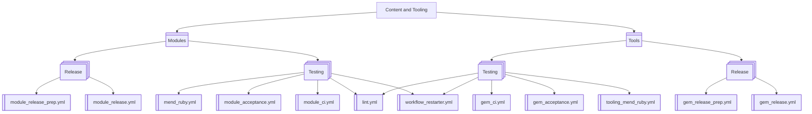

# cat-github-actions

This repository contains GitHub Actions workflows and configurations for automating various tasks related to the `Content and Tooling (CAT)` project. These workflows help ensure code quality, automate testing, and streamline the release process.

## Workflows

The following are the workflows we currently maintain in this repository:
* gem_acceptance: runs automated acceptance CI on tooling PRs
* gem_ci: runs automated unit testing CI on tooling PRs
* gem_release_prep: prepares the gem for release by running necessary pre-release checks and tasks
* gem_release: handles the release process of the gem, including versioning and publishing
* lint: runs linting checks on the codebase to ensure code quality and consistency
* mend_ruby: automates the usage of mend for vulnerability scanning on modules
* module_acceptance: runs automated acceptance CI for modules on PRs
* module_ci: runs automated unit testing CI for modules on PRs
* module_release_prep: prepares the module for release by running necessary pre-release checks and tasks
* module_release: handles the release process of the module, including versioning and publishing
* tooling_mend_ruby: automates the usage of mend for vulnerability scanning on tools
* workflow-restarter-test: tests the workflow restarter functionality
* workflow-restarter: restarts workflows that have failed or need to be re-run

Note: For more information about workflows like workflow-restarter, check out our [docs](./docs/)

## License

   Copyright 2025 Perforce

   Licensed under the Apache License, Version 2.0 (the "License");
   you may not use this file except in compliance with the License.
   You may obtain a copy of the License at

       http://www.apache.org/licenses/LICENSE-2.0

   Unless required by applicable law or agreed to in writing, software
   distributed under the License is distributed on an "AS IS" BASIS,
   WITHOUT WARRANTIES OR CONDITIONS OF ANY KIND, either express or implied.
   See the License for the specific language governing permissions and
   limitations under the License.
